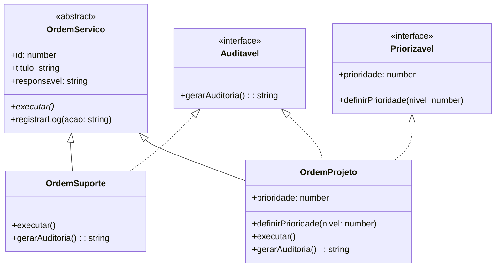

Estrutura de um sistema de gerenciamento de Ordens de Serviço (OS) usando conceitos de Programação Orientada a Objetos (POO). Ele mostra:

1. Classes e Interfaces Principais
OrdemServico (Classe Abstrata)

É a base do sistema, contendo atributos comuns (id, titulo, responsavel) e dois métodos:

executar() (abstrato, deve ser implementado pelas subclasses).

registrarLog() (concreto, já tem implementação padrão).

Marcada como <<abstract>> porque não pode ser instanciada diretamente – só serve para ser herdada.

Priorizavel (Interface)

Define um contrato para classes que podem ter prioridade, com:

Atributo prioridade.

Método definirPrioridade().

Marcada como <<interface>> porque só declara o que deve existir, sem implementar.

Auditavel (Interface)

Exige que classes implementem o método gerarAuditoria().

2. Classes Concretas (Implementações)
OrdemSuporte

Herda de OrdemServico e implementa apenas Auditavel.

Obrigada a fornecer:

Implementação do método abstrato executar().

Método gerarAuditoria() (da interface Auditavel).

OrdemProjeto

Também herda de OrdemServico, mas implementa duas interfaces:

Priorizavel (precisa ter prioridade e definirPrioridade()).

Auditavel (precisa ter gerarAuditoria()).

3. Relacionamentos (Setas no Diagrama)
Herança (<|--)

OrdemServico é pai de OrdemSuporte e OrdemProjeto.

Significa que as classes filhas herdam atributos e métodos da classe abstrata.

Implementação de Interface (<|..)

OrdemProjeto está ligada a Priorizavel e Auditavel porque implementa seus contratos.

OrdemSuporte só implementa Auditavel.

4. Objetivo do Diagrama
Organizar o código mostrando claramente:

O que é compartilhado (na classe abstrata).

O que é obrigatório (nas interfaces).

Como as classes se relacionam.

Facilitar a adição de novos tipos de OS (ex.: OrdemUrgente) sem modificar o código existente.

Exemplo Prático
Se criássemos uma OrdemUrgente, ela:

Herdaria de OrdemServico.

Implementaria Priorizavel (para definir prioridade máxima).

Talvez implementasse Auditavel se gerasse logs.


´´´
flowchart TB
    A[OrdemServico\nAbstrata] --> B[OrdemSuporte]
    A --> C[OrdemProjeto]
    D[Priorizavel\nInterface] ..|> C
    E[Auditavel\nInterface] ..|> B
    E ..|> 

```


Retângulos = Classes/Interfaces.

Setas sólidas = Herança.

Setas tracejadas = Implementação de interface.